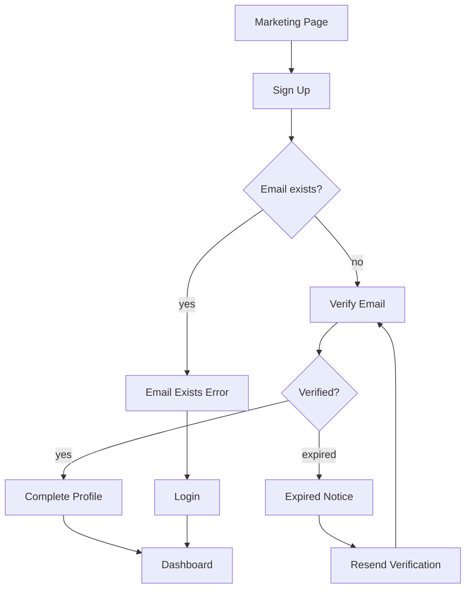

# Goal

Generate a **user-flow / navigation-flow** for a feature from its requirements:
the screens/states a user passes through, the decision points, and the
transitions (including error and alternate paths). Output is a reviewable
diagram expressed as Mermaid plus a structured node/edge list.

This skill produces a **design artifact**, **not code**. It defines the journey
and navigation graph across screens; `wireframe-generator` then details each
individual screen, and the frontend `page-generator` / `layout-generator`
implement routing. A UX flow answers "how does a user move between screens to
accomplish the goal", not "what is inside one screen" (wireframe) and not "how is
it built" (frontend generators).

# Inputs

```yaml
feature_requirements:
  feature: user-onboarding
  goal: "new user creates an account and reaches the dashboard"
  actors: [visitor, authenticated user]
  steps:
    - land on marketing page
    - sign up (email or SSO)
    - verify email
    - complete profile
    - reach dashboard
  edge_cases: [email already exists, verification expired, SSO cancelled]
```

# Output

```yaml
ux_flow:
  feature: <name>
  entry_points: [<where the flow can start>]
  nodes:
    - { id, type, screen, description }   # type: screen | decision | action | end
  edges:
    - { from, to, condition }
  happy_path: [<ordered node ids>]
  alternate_paths: [<error/branch sequences>]
  exit_points: [<terminal states>]
  diagram: <Mermaid flowchart>
```

# Workflow

## Step 1 — Identify actors and entry points

From requirements, list the actors and where the flow can begin (deep link,
marketing page, invite, etc.).

## Step 2 — Build the node graph

Turn each step into a node typed as screen, decision, action, or end. Add
decision nodes for branches implied by `edge_cases`.

## Step 3 — Connect transitions

Draw edges with conditions between nodes, covering the happy path plus alternate
/ error / cancel paths and back-navigation. Ensure every decision node has all
branches and every path reaches an exit point.

## Step 4 — Emit the diagram

Render a Mermaid `flowchart` alongside the structured node/edge list so the flow
is reviewable both visually and programmatically. Keep it at the
navigation/journey level — do not detail screen internals.

# Rules

- Model cross-screen navigation and decisions, not the internals of any single
  screen (that is `wireframe-generator`).
- Every decision node must enumerate all branches; every path reaches an exit.
- Include error, cancel, and back-navigation paths, not just the happy path.
- Produce a design artifact (diagram + node/edge list), never routing code
  (`page-generator` implements navigation).
- Use Mermaid `flowchart` syntax so the diagram renders in plain markdown.
- Reference screens by stable names that `wireframe-generator` can reuse.

# Examples

Input:

```yaml
feature_requirements:
  feature: user-onboarding
  goal: "new user creates an account and reaches the dashboard"
  steps: [land, sign up, verify email, complete profile, dashboard]
  edge_cases: [email already exists, verification expired]
```

Output (abridged):

```yaml
ux_flow:
  feature: user-onboarding
  entry_points: [MarketingPage]
  happy_path: [MarketingPage, SignUp, VerifyEmail, CompleteProfile, Dashboard]
  alternate_paths:
    - [SignUp, EmailExistsError, Login]
    - [VerifyEmail, ExpiredNotice, ResendVerification, VerifyEmail]
  exit_points: [Dashboard, Login]
```

Mermaid diagram:


